# Revenge-Android
Android Version of Revenge (complete)

Revenge is a western-themed game where players battle against each other, putting their reflexes to the test by pressing on 20 targets faster than their opponents and earning personal points along with boosting their town and county points! Supports all towns and counties of Greece.
<html>

  <head>

  </head>

  <body>
  <h3>Welcome Activity</h3>
   
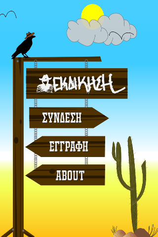
 
<h3>Manual Log In + Forgot password dialog</h3>
 
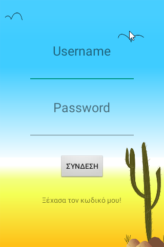
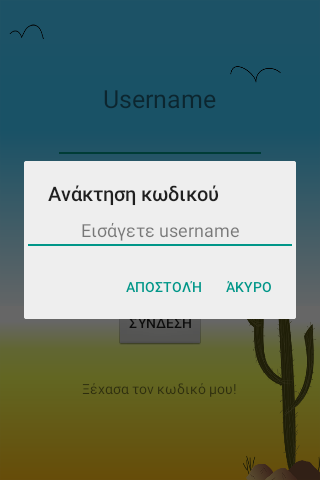
 
  <h3>Sign Up</h3>
   
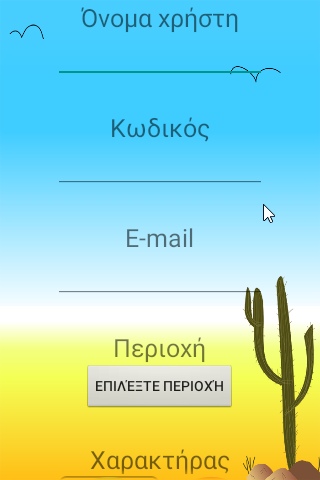
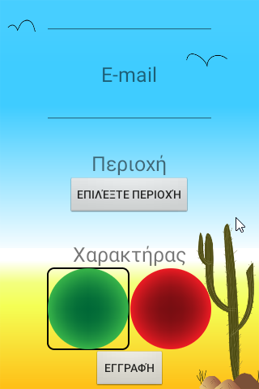
 
<h3>Main Activity (Autologin here on application open)</h3>
 <h5>1)Search for opponent - 2)Challenge Player - 3)Highscores - 4)Friends - 5)Profile - 6)About</h5>
 
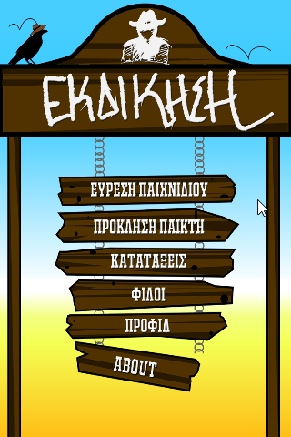
 
<h3>Searching for opponent</h3>
 
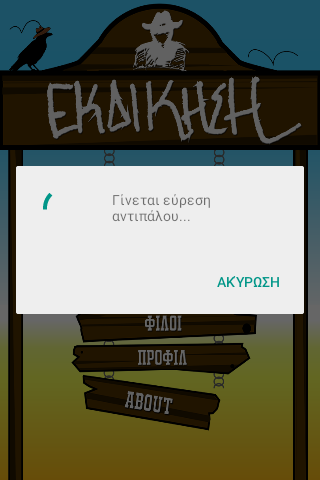
 
<h3>Game starting, game started, waiting for opponent to finish</h3>
 
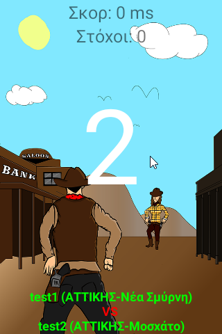
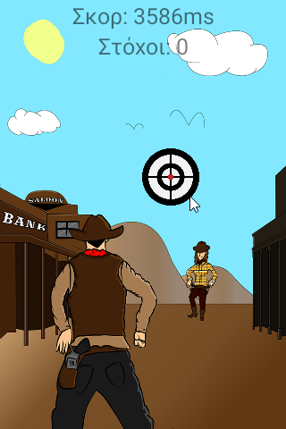
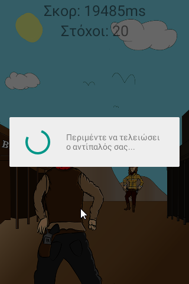
 
<h3>Game ended (replay button turns green if opponent requested replay, red if exited)</h3>
 
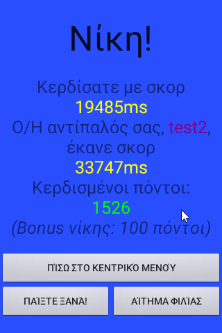
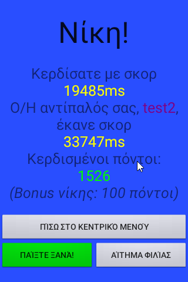
 
<h3>Friend list with online tracking</h3>
 
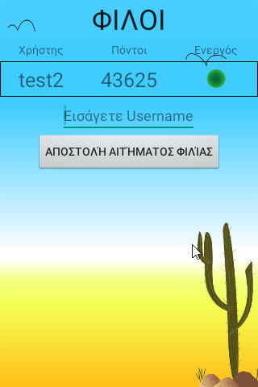
 
<h3>Friend's Profile + Chat</h3>
 
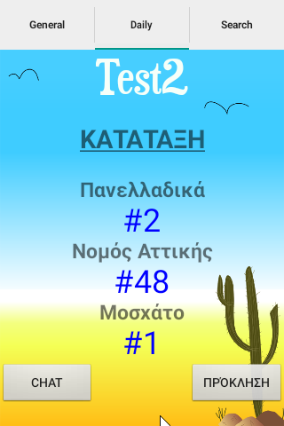
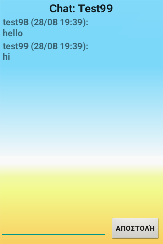
 
<h3><b>Highscores (screenshot content is in bold)</b> 
<b>Daily/General selection</b>, 
<b>Top 100 Daily</b> + General (highlighted green if user), 
<b>Top 100 General</b> + Daily, 
<b>Top Cities/Towns Daily</b> + General(green highlight = user's city/town) with their revenge percentages(algorithm that helps maintain balance between high and low populated cities/towns and counties on highscores),
  <b>Other tab</b>: contains selection of county or town/city in order to view the top 100 players of that particular one (General + Daily)
 +Daily Top 100 players of the Arta County</h3>
 
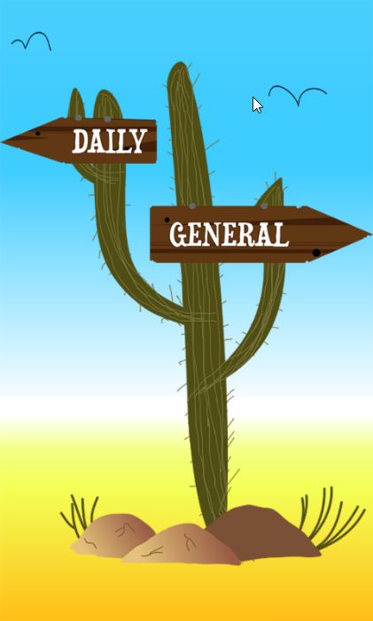
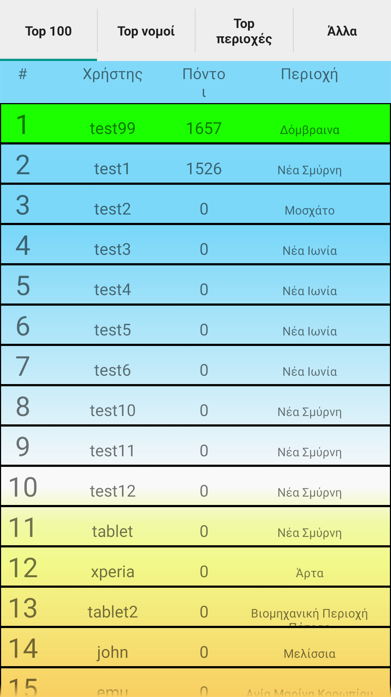
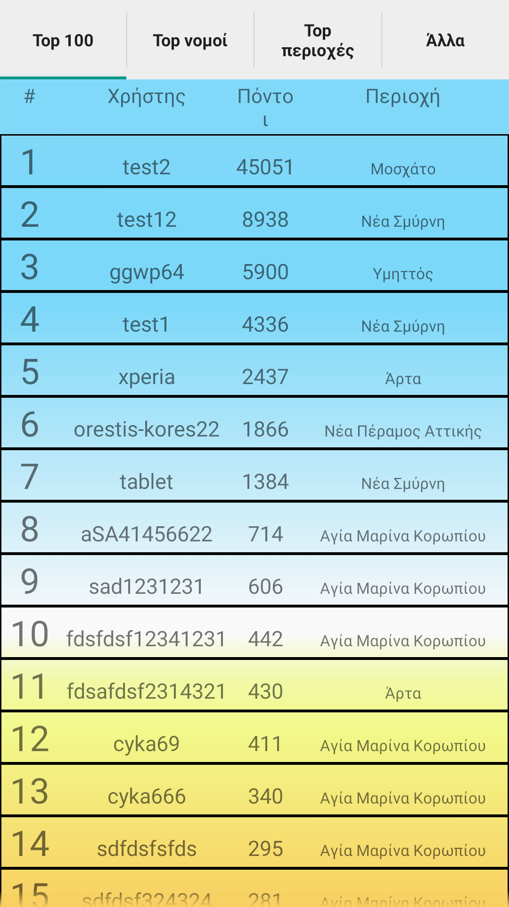
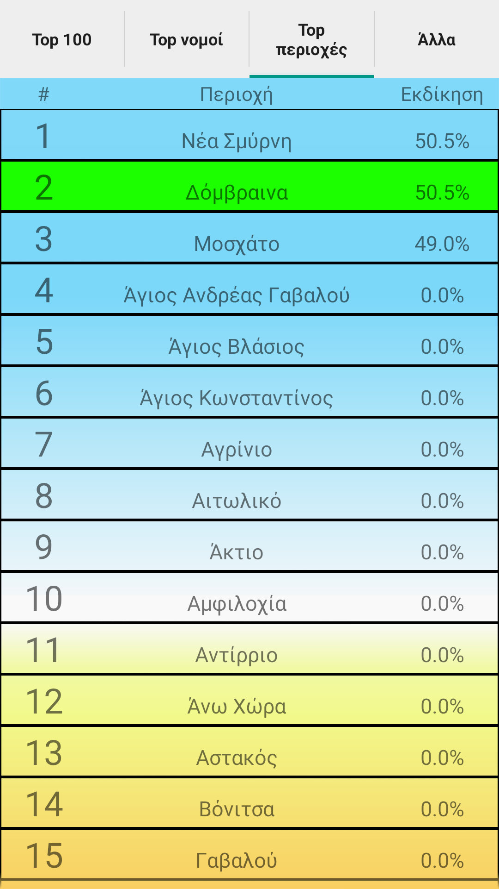
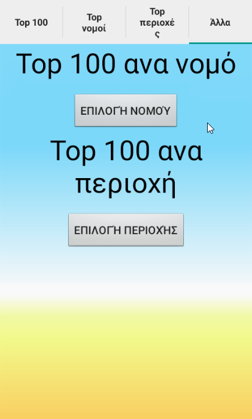
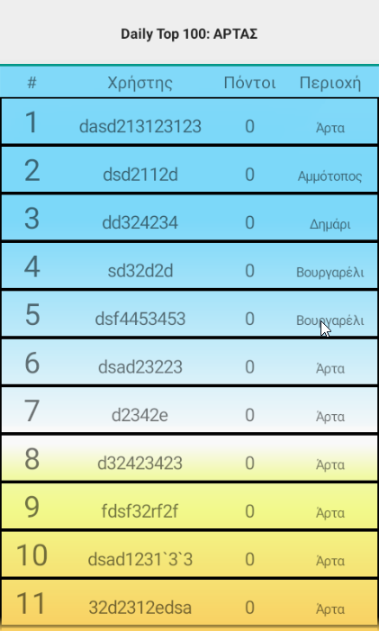
  </body>
</html>
